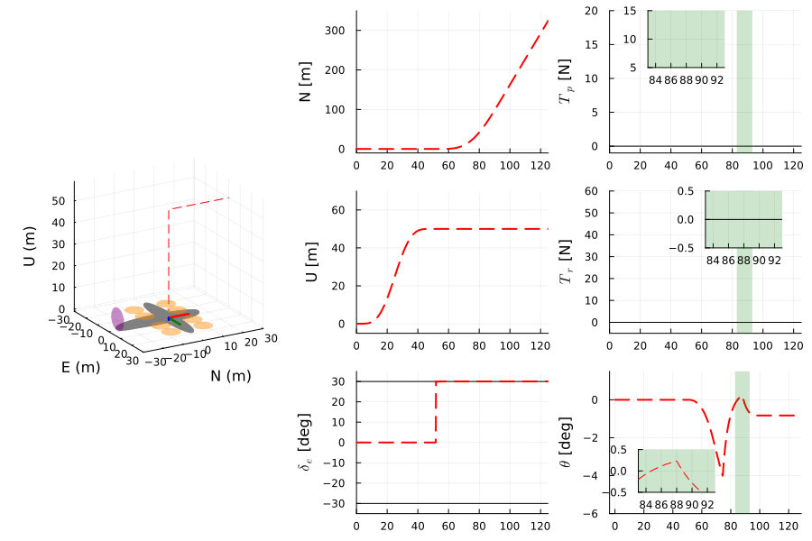

# VTOLSmoothTransitionFlight
Official repository of "Smooth Reference Command Generation and Control for Transition Flight of VTOL Aircraft Using Time-Varying Optimization" [^1].
- Paper: https://arxiv.org/abs/2501.0073
    - The arXiv version contains the latest result.

## Abstract
> Vertical take-off and landing (VTOL) aircraft pose a challenge in generating reference
commands during transition flight. While sparsity between hover and cruise flight modes can be
promoted for effective transitions by formulating ℓ1-norm minimization problems, solving these
problems offline pointwise in time can lead to non-smooth reference commands, resulting in
abrupt transitions. This study addresses this limitation by proposing a time-varying optimization
method that explicitly considers time dependence. By leveraging a prediction-correction interior-
point time-varying optimization framework, the proposed method solves an ordinary differential
equation to update reference commands continuously over time, enabling smooth reference
command generation in real time. Numerical simulations with a two-dimensional Lift+Cruise
vehicle validate the effectiveness of the proposed method, demonstrating its ability to generate
smooth reference commands online.

## Summary
### Formulation
For transition flight of VTOL aircraft,
ℓ1-norm minimization problems can be formulated to encourage the sparsity between (vertical) rotor thrust, $T_{r}$, and (horizontal) pusher thrust, $T_{p}$ [^1] [^2]:

```math
\begin{aligned}
\min_{T_{r}(t), T_{p}(t), \theta_{\text{ref}}(t), \delta_{e}(t)} &\vert T_{r}(t) \vert + \vert T_{p}(t) \vert\
\text{s.t.} &T_{r}(t) \geq 0 \\
&T_{p}(t) \geq 0 \\
&\theta_{\text{ref}}(t) \in [\underline{\theta}, \overline{\theta}] \\
&\delta_{e}(t) \in [\underline{\delta}_{e}, \overline{\delta}_{e}] \\
&T_{p}(t) = F_{\text{des,x}}(t) + D_{1}(t) \\
&-T_{r}(t) = F_{\text{des,y}}(t) + L(t) - D_{2}(t)
\end{aligned}
```

### Methods
1. **OL-Opt**: open-loop optimization-based method [^2].
    - OL-Opt solves optimization problems (ℓ1-norm minimization) for each time and then interpolate solutions over time.
    - OL-Opt is an offline method, i.e., it generates reference commands in advance.
    - OL-Opt does not consider the time dependence in the optimization problem. The interpolation can lead to the generation of non-smooth reference commands.


2. **CL-TVOpt (Proposed)**: closed-loop time-varying optimization-based method [^1].
    - CL-TVOpt solves a time-varying optimization problem by continuously updating the reference command forward in time.
    - CL-TVOpt is an online method, i.e., it generates reference commands in-flight.
    - CL-TVOpt explicitly consider the time dependence in the optimization problem. It generates smooth reference commands as a solution to an ordinary differential equation (ODE).

| OL-Opt | CL-TVOpt (Proposed)|
| ------------- | ------------- |
| | |
 


### Scenarios
#### Scenario 1: Hover-to-cruise
Scenario 1 highlights the effect of non-smooth transition.
##### OL-Opt
- OL-Opt generates non-smooth pitch angle reference command $\theta$, which causes a slight position tracking error $U$ (up). This tracking error is accumulated due to control input saturation.


##### CL-TVOpt (proposed)
- CL-TVOpt generates smooth pitch angle reference command $\theta$, avoiding undesirable position tracking error due to non-smoothness during transition.


#### Scenario 2: Cruise-to-hover
Scenario 1 highlights the effect of initial tracking error.
##### OL-Opt
- OL-Opt is an offline method, which typically causes an inevitable initial tracking error (e.g. in pitch angle $\theta$). A small initial tracking error can be accumulated due to control input saturation, which can yield an abrupt transition flight.


##### CL-TVOpt (proposed)
- CL-TVOpt is an online method that updates the reference commands online, avoiding undesirable tracking errors due to initial tracking error during transition.


### Computation time
Roughly, the mean elapsed time of the CL-TVOpt is **10 times less** than that of OL-Opt.
It is because OL-Opt requires iterations to converge for optimization at each time,
while CL-TVOpt requires solving an ODE for one time step at each time,
exploitating the time dependence via time-varying optimization formulation.
The definition of the mean elapsed time can be found below or in the paper [^1].


## Code
### Data
This repo provides data used in the paper [^1] as follows:
- `./data_plot` contains data for plotting figures.
- `./data_time` contains data to calculate the average elapsed time.

#### Methods
`:opt` and `:tvopt` stand for i) OL-Opt and ii) CL-TVOpt (proposed).

#### Scenarios
Two transition scenarios were considered:
i) `:h2c` (hover-to-cruise) and ii) `:c2h` (cruise-to-hover).


### How to reproduce?
`Manifest.toml` contains all information to re-create the environment for reproducing results.
First, run `julia`.
It is recommended to specify the version, e.g., `julia +1.9.3`, corresponding to `Manifest.toml`.

Then,
```julia
include("main.jl")
```

#### To reproduce simulation results
Run the following commands (with specific scenario and method that you want to test):
```julia
sim(:opt, :h2c)
sim(:opt, :c2h)
sim(:tvopt, :h2c)
sim(:tvopt, :c2h)
```
Data will be stored in `./data`. To plot figures, see `plot_result` for more details.


#### To calculate elapsed times
Run the following commands (with specific scenario (`:h2c` or `:c2h`) and method (`:opt` or `:tvopt`) that you want to test. For example,
```julia
[sim(:opt, :h2c; savestep=Inf) for i in 1:10]
# [sim(:opt, :c2h; savestep=Inf) for i in 1:10]
# [sim(:tvopt, :h2c; savestep=Inf) for i in 1:10]
# [sim(:tvopt, :c2h; savestep=Inf) for i in 1:10]
```
Data will be stored in `./data`. To avoid startup time of Julia, we recommend running the above command twice consecutively and then remove the data generated by the first command execution.
After that, move data from `./data` to `./data_time` and then run the following commands to calculate the elapsed time. See `average_elapsed_time` for more details.
```julia
average_elapsed_time(:opt, :h2c)
```
Note that `savestep=Inf` is used to exclude the calculation time for logging data.
To obtain the average of **mean** elapsed time, the total elapsed time should be divided by the number of points $N = (t_{f}-t_{0}) / \Delta t$.
In this code, $t_{0}=0$ s, $t_{f}=125$ s. OL-Opt (`opt`) is solved for each $0.1$ s and CL-TVOpt (`tvopt`, proposed) is solved for each $0.01$s.
Therefore, $N=1,250$ for OL-Opt and $N=12,500$ for CL-TVOpt.
Note that this code only provides the total elapsed time.


#### Animation
Run the following command with e.g. `your_data_path` = `"./data_plot/tvopt_h2c_tsit5_2024-12-20T18:24:26.726.jld2"`:
```julia
animate(your_data_path)
```


## Cited Works
[^1]: [J. Kim, J. L. Bullock, S. Cheng, N. Hovakimyan, "Smooth Reference Command Generation and Control for Transition Flight of VTOL Aircraft Using Time-Varying Optimization", AIAA SciTech 2025 Forum, Orlando, FL, Jan. 2025.](https://arxiv.org/abs/2501.00739)
[^2]: [J. L. Bullock, S. Cheng, A. Patterson, M. J. Acheson, N. Hovakimyan, and I. M. Gregory, “Reference Command Optimization for the Transition Flight Mode of a Lift Plus Cruise Vehicle,” in AIAA SciTech 2024 Forum, Orlando, FL, Jan. 2024. doi: 10.2514/6.2024-0721.](https://ntrs.nasa.gov/citations/20230016682)
